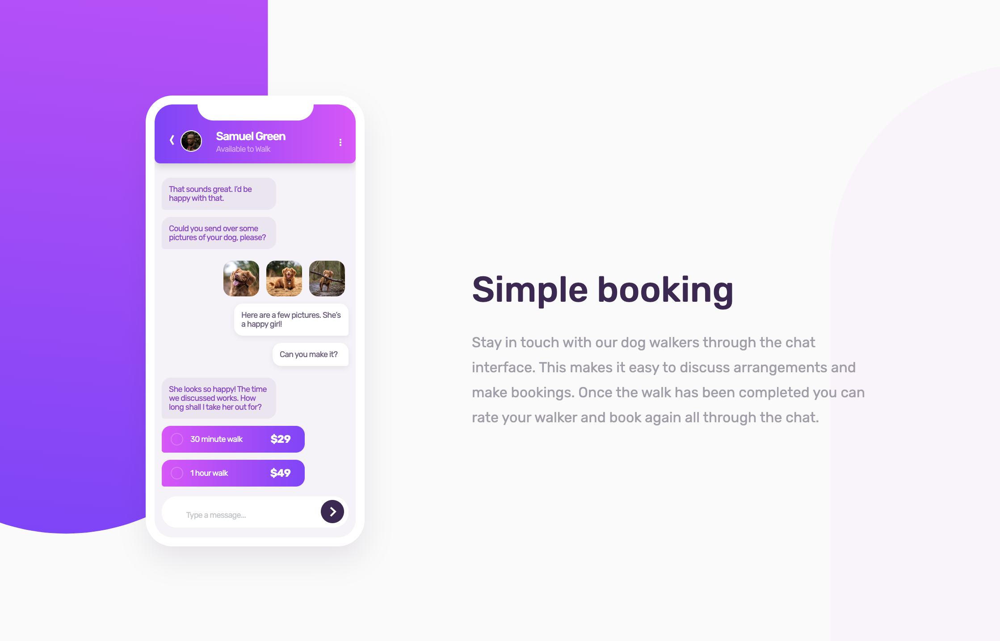

# Frontend Mentor - Chat app CSS illustration solution

This is a solution to the [Chat app CSS illustration challenge on Frontend Mentor](https://www.frontendmentor.io/challenges/chat-app-css-illustration-O5auMkFqY). Frontend Mentor challenges help you improve your coding skills by building realistic projects. 

## Table of contents

- [Overview](#overview)
  - [The challenge](#the-challenge)
  - [Screenshot](#screenshot)
  - [Links](#links)
- [My process](#my-process)
  - [Built with](#built-with)
  - [What I learned](#what-i-learned)
  - [Continued development](#continued-development)
  - [Useful resources](#useful-resources)
- [Author](#author)
- [Acknowledgments](#acknowledgments)

## Overview

### The challenge

Users should be able to:

- View the optimal layout for the site depending on their device's screen size

### Screenshot

### Links

- Solution URL: [Add solution URL here](https://github.com/olgak169/FMChatAppChallenge/)
- Live Site URL: [Add live site URL here](https://olgak169.github.io/FMChatAppChallenge/)

## My process

### Built with

- Semantic HTML5 markup
- Sass

### What I learned

Animation with css is a pain in the neck))

### Continued development

...

### Useful resources

...

## Author

- Frontend Mentor - [@olgak169](https://www.frontendmentor.io/profile/olgak169)

## Acknowledgments

Good challenge! Thanks to Frontend Mentor for the oportunity.
